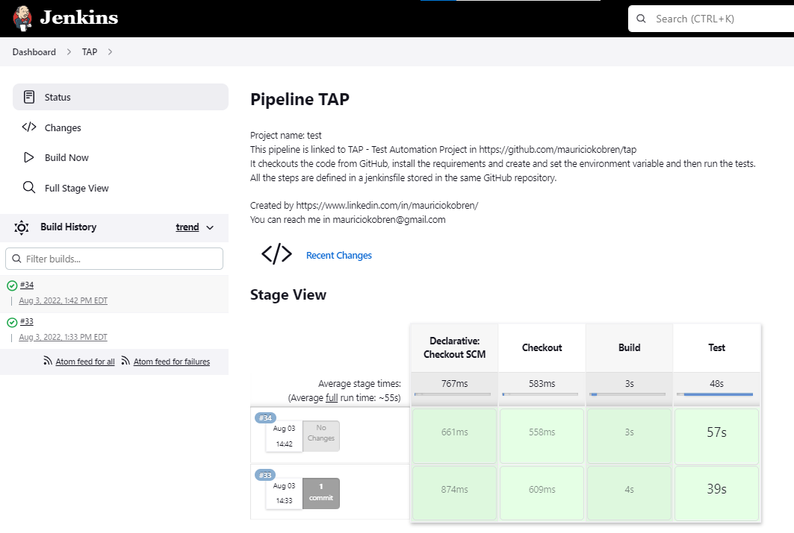

# Test Automation Project (TAP)

## Introduction
TAP is a simple test automation project written in python and aplying page object model. It uses Selenium as the automation framework and unittest library.
The application used as the base for the tests is GitHub website.

## Page Object Model
The Page Object Model (POM) is a design pattern that creates an object repository for storing all web elements.
When using POM you have the following benefits:
- Clean and more redable code of your tests since they are splited from the code of web elements manipulation
- Reduced maintenance since sometimes you just need to adjust things in page classes without touching the code of your tests
- More code reusage since new tests can use the same page classes


## Structure
TAP is structured files distributed in 3 folders:
- _pages_: this folder contains all the files implementing the classes that represent the pages and the elements (fields, buttons, etc).
- _testdata_: this folder contains the class with all the values used in the testes
- _tests_: this folder contains the files with the tests properly saying. 

### Pages
All the classes that represent pages or page elements (fields, buttons, etc) are stored here. They contain properties representing parts of each page and also methods that are the actions the user can do in each page.
The pages available are:
- _Homepage_: represents GitHub main page
- _SearchResultPage_: represents GitHub Search Results page
- _UserPage_: model for user page in GitHub
- _UserRepoPage_: model for GitHub User Repository page

All the pages where extended from _BasePage_. At the moment no properties or methods were added to this class, but it could be the case if we need a certain behavior in all the pages. 

The _BasePageElement_ is an extension of Selenium WebElement class with additional methods _set_text(self,text)_, _get_text()_ and _hit_enter(self)_.

All the locators used to find fields, buttons or drop downs were added in classes stored in _locators.py_: _HomepageLocators, SearchResultPageLocators, RepositorySearchLocators and UserRepoPageLocators_.

The locators are defined as python tuples data type informing the type of the locator and the corresponding string. Here are some examples:
```
SEARCH_FIELD_LOCATOR = (By.NAME,'q')
REPO_SEARCH_FIELD_LOCATOR = (By.ID,'your-repos-filter')
LANGUAGE_FILTER_BUTTON_LOCATOR = (By.XPATH, '//*[@id="language-options"]/summary')
```


### TestData
All the values used in the testes are represented as methods of the class **_TestData_**. 
For example, to store the url ot GitHub the property below was created:

`GITHUB_URL = "https://github.com/"`

This property is used in many other places (mainly page classes) and also to create more complex urls.
The advantage of this technique is that if we need to change the url, we just need to chang in TestData class and all the other classes will use the new value.


### Tests
At this point, there is only one file called _tests.py_ with 2 classes:
- **_GitHubSearch_**: this class has 1 test over the Search by User in GitHub
- **_GitHubRepoSearch_**: this class has 2 tests on the Repository Search and filtering, starting from an user page


### Logging
Python logging library was used to log information about the progress of each test.
To do that, first we need to import the library:
`import logging`

Then define the log level. In this case Information was used:
`logging.basicConfig(level=logging.INFO)`

Then logging.info was called each time it was interesting to inform some progress of the tests. For example:
```
def test_search_in_github(self):  
  logging.info('-----------------------------------------------')  
  logging.info('Starting to test search feature on GitHub')  
  logging.info('Loading github homepage')  
  home_page = homepage.Homepage(self.driver)  
```

It's also interesting to note that the message added in each logging instruction also works as comments of the code.  

## Manual execution of the tests
First you need to clone the repository in your machine.  
You need to have Selenium library. To install using pip: ```pip install selenium```  
More details here: https://selenium-python.readthedocs.io/installation.html

To run all the tests, from tap folder:  
```cd tests  
python test.py
```  

You should see an output likes this, if all the tests passed:  


To run just a specific test, assuming you already are in tests folder:  
```python test.py Class.Desired_test```  

For example:   
```python test.py GitHubRepoSearch.test_search_by_existing_repo_in_user_page```  

An interesting option was added: run the tests in headless mode, it means, without opening the browser.  
To activate this option, you need to add an environment variable:  
 Linux: ```export TAP_HEADLESS=1```  
 Windows: ```set TAP_HEADLESS=1```  

This option should work in both.


## Workflow in GitHub Actions
For testing purpose, a workflow was created using GitHub Action.  


Its name is **CI** and its definition file is here: https://github.com/mauriciokobren/tap/blob/master/.github/workflows/main.yml  

Basically it checks out the code in a Linux instance, install the dependencies and run the tests.  
**CI** workflow is triggered every time a pull request agains master is created or when a commit in master is done.  

Clicking on a specific build, you can see more details, something like the image below.  


To see the steps of the run, just click on build. You should see something like the image below:  


The article below was very useful to understand how to setup the GitHub Actins workflow (AWS part was not implemented):  
https://www.freecodecamp.org/news/how-to-setup-a-ci-cd-pipeline-with-github-actions-and-aws/  

## Jenkins Pipeline to run the tests  
In order to demonstrate how the test execution can be automated with Jenkins, I have created the following solution:  
- Createad an EC2 server in Amazon Web Services (AWS) running on Amazon Linux 2
- Installed and configured Jenkins, git, python, firefox and geckodriver in this machine
- Created the TAP pipeline to run the tests  

TAP pipeline is defined in [jenkinsfile](jenkinsfile) and has the following stages:
- **Checkout** the code from GitHub  
- **Build** to install the requirements and grant permissions  
- **Test** to execute the tests defined in TAP  

To see it in action you can visit [Jenkins TAP Pipeline](http://ec2-18-228-232-60.sa-east-1.compute.amazonaws.com:8080/job/test/).  
You can log in with guest / guest. You should see something like the image below:  


## Next steps and improvements
Maybe there is a better way to handle the import of modules stored in different folders. For example, in _tests\test.py_ I need to import modules stored in _pages_ folder. After some research on the internet, I found that the folder should be added in python path:
```
...
sys.path.append(os.path.abspath(os.path.join('..', 'pages')))
sys.path.append(os.path.abspath(os.path.join('..', '')))
from pages import homepage,userpage,userrepopage
...
```

The webdriver obejct is created in the _setup()_ of test classes in tests/test.py. For now Firefox browser was chosed, but more browsers could be supported, like Chrome for example.

No screenshot or video is recorded when a test fails. This can be a good resource for analysis.


